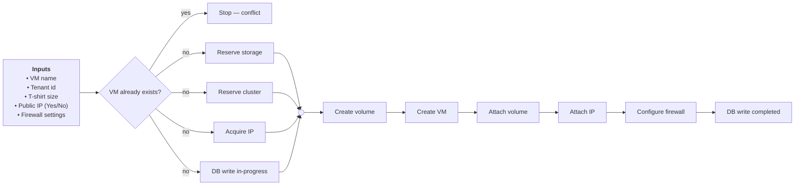
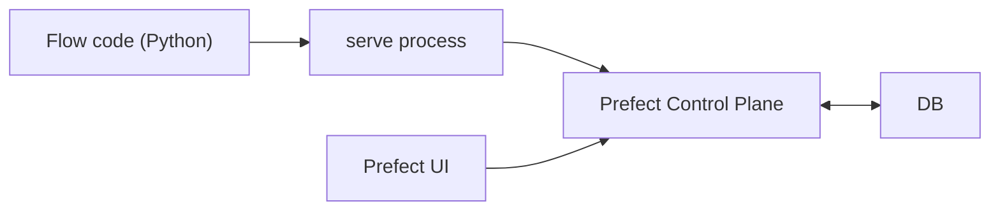

# Prefect is almost Perfect!

Python Workflow/Orchestration Engine design for humans

<!--
Opening: orchestration connects code to reliable production runs—scheduling, retries, observability, and infrastructure without reinventing a platform.
-->


---
layout: default
---

# About Me

- **Name:** Borislav Varadinovs
- **Company:** Dell Technologies
- **Role:** Senior Principal Engineer


---
layout: default
---

# Agenda

<v-clicks>

- Introduction & core concepts
- Flows, tasks, and building workflows
- Running, deploying, and scheduling
- Infrastructure & Prefect Cloud / Server
- Observability and advanced features 
- Use cases, demo ideas, best practices & summary

</v-clicks>


---
layout: section
---

# Introduction

What Prefect is, why orchestration matters, and where it sits in your stack


---
layout: default
---

# What is a Workflow Engine?

- Software component that orchestrates a sequence of tasks
  - Automates
  - Executes
  - Manages

- Based on predefined 
  - Rules
  - Logic
  - Conditions

---
layout: default
---

# Use cases for Workflow Engine?

- Data Processing Pipelines
- AI/ML Model Training Pipeline
- AI Embeddings orchestration
- API Event Driven Sync
- Infrastructure & Platform Automation
- Document Processing Pipelines
- Business Process Automation

---
layout: default
---

# Workflow/Orchestration Engines

- Camunda 
  - Business process engine with visual workflows (BPMN)

- Apache Airflow 
  - Cron for data pipelines with DAGs

- Temporal 
  - Reliable stateful orchestration for distributed systems

- Prefect (Dynamic Workflows)
  - Python-native orchestration for flexible and dynamic workflows

---
layout: default
---

# What is Prefect?
- Workflow orchestration engine
  - Coordinates multiple tasks
  - Handles dependencies and state
  - Manages retries, failures, and scheduling
  - Observes and logs execution
  - More...

- Pure and beautiful Python
- No DSL, XML, JSON, YAML, etc.
- Open Source (Apache 2.0)

---
layout: default
---

# Prefect Key Features
- ✅ Dynamic workflows (not static DAGs)
- ✅ Retries & error handling built-in
- ✅ Parameterization of flows
- ✅ Caching and result persistence
- ✅ Scheduling & event-based triggers
- ✅ Observability (logs, UI, monitoring)
- ✅ Concurrency & parallelism control
- ✅ Testing & local development
- ✅ Native transactional interface (Rollbacks)

---
layout: default
---

# Install Prefect
* Using pip
```bash
pip install prefect
```

* Using uv
```bash
uv add prefect
```


---
layout: default
---

# Prefect Flow Example
````md magic-move {lines: true }
```python {*}
import requests
import json

def fetch_weather(city: str) -> str:
    url = f"https://wttr.in/{city}?format=j1"
    data = requests.get(url).json()
    return data["current_condition"][0]["temp_C"]

def save_to_file(weather_data: list, filename: str) -> None:
    with open(filename, "w") as f:
        json.dump(weather_data, f)

def main() -> None:
    cities = ["Sofia", "London", "New York"]
    weather_data = []
    for city in cities:
        weather_data.append({"city": city, "temperature": fetch_weather(city)})
    save_to_file(weather_data, "01_weather_data.json")

if __name__ == "__main__":
    main()

```
```python {3,5,11,16|*}
import requests
import json
from prefect import flow, task

@task
def fetch_weather(city: str) -> str:
    url = f"https://wttr.in/{city}?format=j1"
    data = requests.get(url).json()
    return data["current_condition"][0]["temp_C"]

@task
def save_to_file(weather_data: list, filename: str) -> None:
    with open(filename, "w") as f:
        json.dump(weather_data, f)

@flow
def main() -> None:
    cities = ["Sofia", "London", "New York"]
    weather_data = []
    for city in cities:
        weather_data.append({"city": city, "temperature": fetch_weather(city) })
    save_to_file(weather_data, "01_weather_data.json")

if __name__ == "__main__":
    main()
```
````
<style>
:deep(.slidev-code-wrapper pre.shiki) {
  font-size: 12px !important;
  line-height: 1.25 !important;
}

:deep(.slidev-code-wrapper pre.shiki .shiki-magic-move-item) {
  font-size: inherit !important;
}
</style>


---
layout: default
---

# Complex Workflow Diagram Example 

* Create Virtual Machine

<br />



---
layout: section
---


# Core Concepts Overview

Architecture, vocabulary, and the lifecycle mental model


---
layout: default
---

# Prefect Architecture Overview (The simple way)



- **Flow code** 
  - Runs locally in a `serve` process and talks to API
- **Prefect UI** 
  - Talks to the **API (Control Plane)** 
- **Prefect Control Plane** 
  - API, Orchestration Engine, Scheduler, UI
  - Persists state/metadata in the **DB**


---
layout: default
---

# Key Concepts

* **Flow:** Top-level workflow: a `@flow` Python callable
* **Task:** `@task` unit of work: retries, caching, concurrency hooks 
* **Deployment:** Published version of the flow
* **Flow run:** an execution of a flow
* **Task run:** an execution of a task within that run


---
layout: default
---

# Flow

- Function decorated with **`@flow`**
- Top-level **entry** 
- Composes graph of **tasks** 
- Optional parameters
- Dynamic structure
- Nested Flows

---
layout: default
---

# Task

- Function decorated with **`@task`**
- Optional parameters
- Optional **Retries**, **retry delays**, and **timeouts** 
- **Caching** 
- **Result Persistence**


---
layout: default
---

# Concurrency and Parallel Execution

- **Sequentially** running tasks can be slow  
- **Fan-out** task runs **concurrently**
- Schedule tasks with **`.submit()`** 
- **Fan-in** results with **`future.result()`** 
- Use **concurrency limits** 

---
layout: default
---

# Schedules
Rules on a **deployment** that tell  **when** to **start new flow runs** automatically

<br />

* **Schedule types** (built-in):

| Type | Use case |
|------|----------|
| **Cron** | “Every day at 06:00 UTC”, classic ops schedules |
| **Interval** | Every *N* minutes/hours — simple periodic runs |
| **RRule** | Complex calendars (e.g. weekdays, exceptions) |


---
layout: default
---

# Tasks Retries

- **Configure per-task** retry policy with `@task(...)`
- `retries`: number of retry attempts after a **Failed** task run
- `retry_delay_seconds`: **seconds**, a **list** of delays, or a callable (e.g. `exponential_backoff`)
- `retry_condition_fn`: decide *whether* to retry for a specific failure

```python
from prefect import flow, task
from prefect.tasks import exponential_backoff

@task(
    retries=4,
    retry_delay_seconds=exponential_backoff(backoff_factor=2),
)
def fetch():
    raise RuntimeError("transient error")

@flow
def pipeline():
    fetch()
```

---
layout: default
---

# Tasks Persistence
- **Persist task results** to storage
- `persist_result=True/False` (defaults to global setting; **True by default**)
- Storage options - Local FS (Default),S3,GCP,Azure,Any fsspec,Custom 

```python
from prefect import flow, task
from prefect_aws.s3 import S3Bucket

s3 = S3Bucket.load("my-results")

@task(
    persist_result=True, result_storage=s3
)
def load_weather():
    return {"temp_c": 21}

@flow
def pipeline():
    load_weather()
```

---
layout: default
---

# Tasks Caching and Idempotency

- **Caching**
  - Reuse a previous task **result** instead of re-running
  - Great for expensive / deterministic steps
  - Needs **result persistence** 
  - Custom **cache key**

<br />

- **Idempotency** (side effects): 
  - Tasks must be idempotent 
  - Safe to retry without creating duplicates


---
layout: default
---

# Artifacts
- Rich outputs attached to runs 
- Shown in the **Prefect UI**
- Markdown, Table, Link, Image, Progress

```python
from prefect import flow, task
from prefect.artifacts import create_markdown_artifact

@task
def report():
    create_markdown_artifact(
        key="daily-report",
        markdown="# Daily report\n- ok",
        description="Run summary",
    )

@flow
def pipeline():
    report()
```

---
layout: default
---

# Event-Driven Workflows

- Automations based on events
  - Trigger flows based on emitted events

- External Systems
  - Trigger flows by **API** (from services, CI/CD, scripts)


---
layout: section
---

# Prefect Cloud vs Self-Hosted

Control plane options


---
layout: default
---

# Prefect Cloud Overview

- **Managed control plane:** API + UI
- **Flows runs:** execution stays in your network 
- **Enterprise** features (Workspaces, SSO, RBAC tiers, support)
- **Billing** typically tied to **usage**


---
layout: default
---

# Prefect Server (Self-Hosted)
- **Open-source Prefect server** + **Postgres**
- Full control over **data residency**, **networking**, and **upgrades**
- Operate **backups**, **HA**, and **security** patches
- Limitations for Authentication, Authorization and Audit
